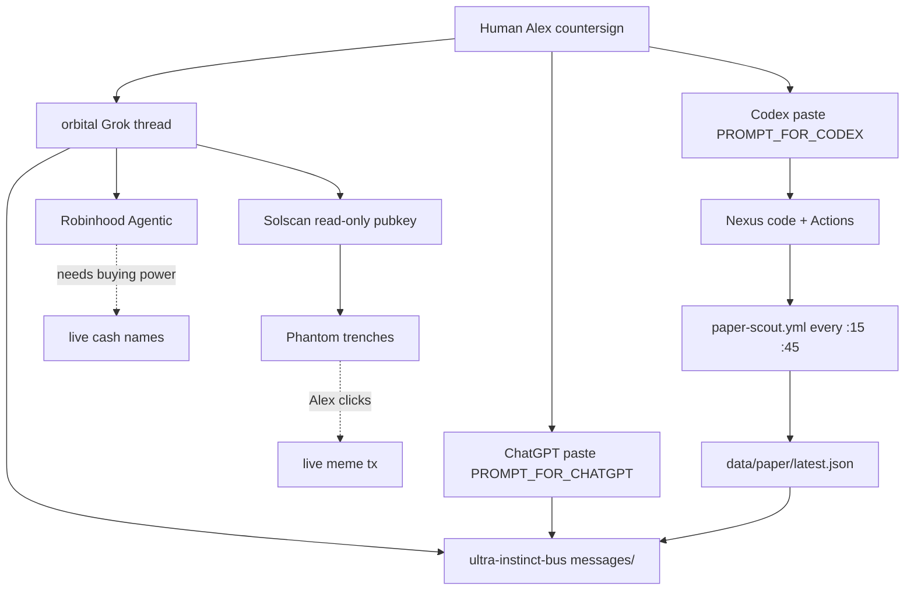

# Eagle eye — what we can actually run

## Ours

| Repo | Job | Niche value |
|---|---|---|
| `Nexus` | Factory. Paper scout, Hoot eval, social automation | The only runner |
| `ultra-instinct-bus` | Shared memory between Grok / ChatGPT / Codex | The only socket |

Do not add a third civilization repo.

## Feeds the scout is allowed to touch (no keys)

1. Binance 24hr — blocked with HTTP 451 on GitHub-hosted runners
2. CoinGecko simple price — works until 429
3. Kraken public ticker — survives GH runners
4. Dexscreener token-boosts — Solana meme heat, best-effort
5. alternative.me fear/greed — optional

## Leverage required to run each eye

Minimum leverage: one open Grok thread + Actions green + one public SOL addy.
Maximum leverage we do not have: GMGN MCP, Phantom sign, Kraken API, 24/7 daemon.
